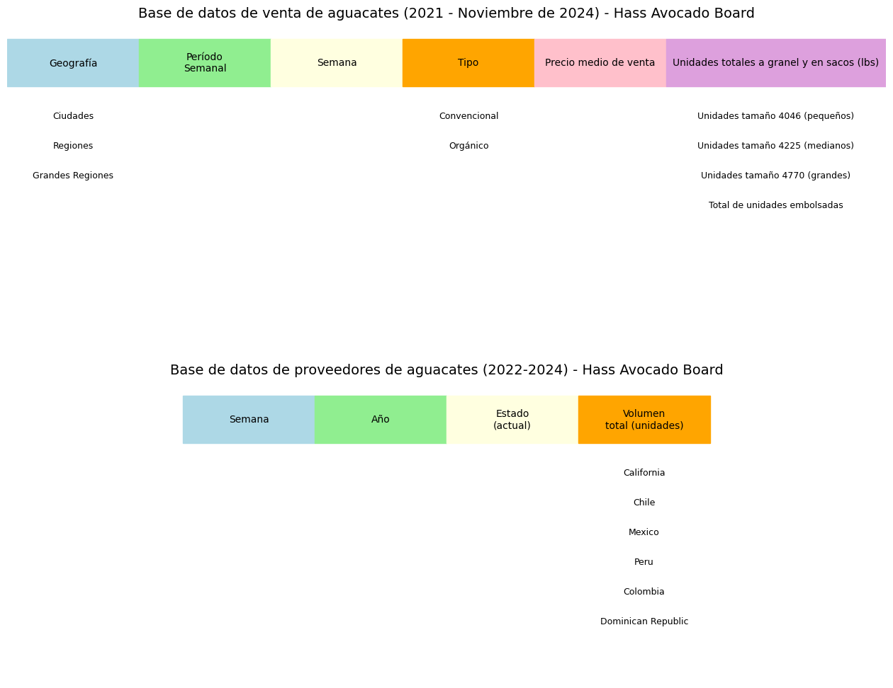

# Análisis de Datos Avanzado
**Objetivo**: Desarrollar un modelo predictivo para estimar el precio promedio del aguacate en el próximo año en una de las regiones con mayor demanda en Estados Unidos, con el fin de establecer estrategias para la apertura de una nueva sucursal en el mercado.

**Integrantes**:
- Albert Bañeres Rovirosa
- Cristian Largo Reina
- Elvis Ortega Ochoa

**Planificación:** [Github Projects](https://github.com/users/arboldeku/projects/1)

## **Calidad de datos**

### **Base de datos de venta de aguacates (2021 - Noviembre de 2024) - Hass Avocado Board**

Se observa que la base de datos de venta de aguacates contiene registros hasta la semana **1 de noviembre de 2024**. Para completar los datos faltantes del año, se llevaron a cabo los siguientes pasos:
1.	Se filtró el cuarto trimestre de los años 2021, 2022 y 2023 de la base de datos.
2.	Se calculó el promedio mensual de las columnas “ASP Current Year”, “Total Bulk and Bags Units”, “4046 Units”, “4225 Units”, “4770 Units” y “Total Bagged Units”, teniendo en cuenta la geografía y el tipo de aguacate.
3.	Se creó una nueva base de datos llamada proyeccion_df, que contiene la proyección de los datos correspondientes a las 3 semanas restantes de noviembre y las 5 semanas de diciembre de 2024, utilizando los resultados del cálculo anterior. El **número de registros nuevos es 944**, que corresponden a 8 semanas por cada tipo de aguacate, 16 por cada geografía (16*59 = 944)
4.	Finalmente, se combinó la base de datos de venta de aguacates con la proyección de 8 semanas.

**Tipo de objeto:** `pandas.core.frame.DataFrame`

**Rango de índices:** 24536 entradas, de 0 a 24535

**Columnas de datos (total 13 columnas):**

| #  | Columna                    | Conteo de No Nulos | Tipo de Dato    |
|----|----------------------------|--------------------|-----------------|
| 0  | Geography                  | 24536 no nulos     | object          |
| 1  | Timeframe                  | 24536 no nulos     | object          |
| 2  | Current Year Week Ending   | 24536 no nulos     | datetime64[ns]  |
| 3  | Type                       | 24536 no nulos     | object          |
| 4  | ASP Current Year           | 24536 no nulos     | float64         |
| 5  | Total Bulk and Bags Units  | 24536 no nulos     | float64         |
| 6  | 4046 Units                 | 24536 no nulos     | float64         |
| 7  | 4225 Units                 | 24536 no nulos     | float64         |
| 8  | 4770 Units                 | 24536 no nulos     | float64         |
| 9  | TotalBagged Units          | 24536 no nulos     | float64         |
| 10 | SmlBagged Units            | 0 no nulos         | float64         |
| 11 | LrgBagged Units            | 0 no nulos         | float64         |
| 12 | X-LrgBagged Units          | 0 no nulos         | float64         |

**Tipos de datos:** datetime64[ns](1), float64(9), object(3)

**Uso de memoria:** 2.4+ MB

### **Base de datos de proveedores de aguacates (2022-2024) - Hass Avocado Board**

**Tipo de objeto:** `pandas.core.frame.DataFrame`

**Rango de índices:** 208 entradas, de 0 a 207

**Columnas de datos (total 10 columnas):**

| #  | Columna              | Conteo de No Nulos | Tipo de Dato |
|----|----------------------|--------------------|--------------|
| 0  | Week Ending          | 208 no nulos       | object       |
| 1  | Year                 | 208 no nulos       | int64        |
| 2  | Status               | 208 no nulos       | object       |
| 3  | Total Volume         | 208 no nulos       | object       |
| 4  | California           | 208 no nulos       | object       |
| 5  | Chile                | 208 no nulos       | object       |
| 6  | Mexico               | 182 no nulos       | object       |
| 7  | Peru                 | 208 no nulos       | object       |
| 8  | Colombia             | 208 no nulos       | object       |
| 9  | Dominican Republic   | 156 no nulos       | object       |

**Tipos de datos:** int64(1), object(9)

**Uso de memoria:** 16.4+ KB

**Distribucción de la geografía de acuerdo a ciudades, regiones y grandes regiones**

| Ciudades (34)                         | Regiones (16)                        | Grandes regiones (8) |
|---------------------------------|--------------------------------|-----------------|
| Albany                          | Baltimore/Washington           | **California**      |
| Atlanta                         | Birmingham/Montgomery          | Great Lakes     |
| Boise                           | Buffalo/Rochester              | Midsouth        |
| Boston                          | Cincinnati/Dayton              | Northeast       |
| Charlotte                       | Dallas/Ft. Worth               | Plains          |
| Chicago                         | Harrisburg/Scranton            | South Central   |
| Columbus                        | Hartford/Springfield           | Southeast       |
| Denver                          | Miami/Ft. Lauderdale           | West            |
| Detroit                         | New Orleans/Mobile             |                 |
| Grand Rapids                    | Northern New England           |                 |
| Houston                         | Peoria/Springfield             |                 |
| Indianapolis                    | Phoenix/Tucson                 |                 |
| Jacksonville                    | Raleigh/Greensboro             |                 |
| Las Vegas                       | Richmond/Norfolk               |                 |
| Los Angeles                     | South Carolina                 |                 |
| Louisville                      | West Tex/New Mexico            |                 |
| Nashville                       |                                |                 |
| New York                        |                                |                 |
| Orlando                         |                                |                 |
| Philadelphia                    |                                |                 |
| Pittsburgh                      |                                |                 |
| Providence                      |                                |                 |
| Portland                        |                                |                 |
| Roanoke                         |                                |                 |
| Sacramento                      |                                |                 |
| San Diego                       |                                |                 |
| San Francisco                   |                                |                 |
| Seattle                         |                                |                 |
| Spokane                         |                                |                 |
| St. Louis                       |                                |                 |
| Syracuse                        |                                |                 |
| Tampa                           |                                |                 |
| Toledo                          |                                |                 |
| Wichita                         |                                |                 |

### **Base de datos de ventas de aguacates y proveedor en California (2022-2024)**

Reglas para mezclar la base de datos de venta de aguacates y proveedor en California:
Se agrupo por "Current Year Week Ending".
- "Geografía" y "Timeframe" tienen el mismo valor.
- "Tipo": Orgánico y Convencional
- "Precio medio de venta": media del precio del aguacate convencional y orgánico
- "Unidades totales a granel y sacos (lbs)": suma del volumen de aguacates convencional y orgánico
- "Unidades 4046 (pequeños)": suma del volumen de aguacates convencional y orgánico
- "Unidades 4225 (medianos)": suma del volumen de aguacates convencional y orgánico
- "Unidades 4770 (grandes)": suma del volumen de aguacates convencional y orgánico
- "Total de unidades embolsadas": suma del volumen de aguacates convencional y orgánico
- "Elasticidad": media de la elasticidad de la demanda de aguacates convencional y orgánico

**Dilema de libras y unidades**
Teniendo en cuenta que los datos en la base de datos de proveedores están expresados en **unidades**, mientras que la base de datos de ventas utiliza **libras**, se realizó la conversión de las columnas “4046 Units”, “4225 Units”, “4770 Units” y “TotalBagged Units” a unidades. Esta conversión se llevó a cabo utilizando el volumen promedio correspondiente a cada tipo de aguacate:
- 1 aguacate 4046 = 0.19 lbs
- 1 aguacate 4225 = 0.50 lbs
- 1 aguacate 4770 = 0.63 lbs
- Volumen promedio de un aguacate de “TotalBagged Units” = 0.5 lbs

Los resultados de esta transformación fueron almacenados en las columnas: “Unidades pequeñas”, “Unidades medianas”, “Unidades grandes” y “Unidades de aguacates en bolsas”. Posteriormente, la suma de estas columnas fue calculada y registrada en “Total Unidades en Granel y Bolsas”, que representa la métrica equivalente a “Total Bulk and Bags Units” en libras.

**Tipo de objeto:** `pandas.core.frame.DataFrame`

**Rango de índices:** 156 entradas, de 0 a 155

**Columnas de datos (total 17 columnas):**

| #  | Columna                           | Conteo de No Nulos | Tipo de Dato |
|----|-----------------------------------|--------------------|--------------|
| 0  | Current Year Week Ending          | 156 no nulos       | object       |
| 1  | Geography                         | 156 no nulos       | object       |
| 2  | Timeframe                         | 156 no nulos       | object       |
| 3  | Type                              | 156 no nulos       | object       |
| 4  | ASP Current Year                  | 156 no nulos       | float64      |
| 5  | Total Bulk and Bags Units         | 156 no nulos       | float64      |
| 6  | 4046 Units                        | 156 no nulos       | float64      |
| 7  | 4225 Units                        | 156 no nulos       | float64      |
| 8  | 4770 Units                        | 156 no nulos       | float64      |
| 9  | TotalBagged Units                 | 156 no nulos       | float64      |
| 10 | Elasticity                        | 156 no nulos       | float64      |
| 11 | California Supplier               | 156 no nulos       | object       |
| 12 | Unidades pequeñas                 | 156 no nulos       | float64      |
| 13 | Unidades medianas                 | 156 no nulos       | float64      |
| 14 | Unidades grandes                  | 156 no nulos       | float64      |
| 15 | Unidades Aguacates en Bolsas      | 156 no nulos       | float64      |
| 16 | Total Unidades en Granel y Bolsas | 156 no nulos       | float64      |

**Tipos de datos:** float64(12), object(5)

**Uso de memoria:** 20.8+ KB

## **Exploración de datos**

### **Análisis bivariado de la venta de aguacates en las grandes regiones y California**

**Media del total de unidades a granel y en sacos (lbs) por Grandes regiones**

La gráfica de barras muestra la media del total de unidades a granel y en sacos (en libras) en diferentes grandes regiones. Las principales observaciones son:
1. La región Oeste tiene la media más alta, superando los 3.5 millones de libras, seguida de cerca por California y Sureste.
2.	La región de Plains presenta la media más baja, con poco más de 1 millón de libras, muy por debajo del resto de las regiones.
3.	Regiones como Noreste, Grandes Lagos y Midsouth muestran medias moderadas, cercanas a los 2.5 millones de libras.
4.	La región Centro Sur también destaca con un total relativamente alto, cercano a los 3 millones de libras.

Esto sugiere que las ventas de aguacates (medidas en unidades a granel y en sacos) son particularmente fuertes en las regiones Oeste, Sureste y California, mientras que la región de Plains muestra un rezago significativo. En este análisis se debe tener en cuenta el **tamaño del mercado** en cada una de las grandes regiones.

**Grandes regiones: Media del total de unidades a granel y en sacos (lbs) por Trimestre**

La gráfica muestra la evolución trimestral de la media del total de unidades a granel y en sacos (en libras). Las principales observaciones son:
1.	2021 inicia con valores altos cercanos a los 3.2 millones de libras, pero presenta una caída constante a lo largo del año.
2.	A principios de 2022, se observa un mínimo alrededor de 2.4 millones de libras, seguido de un repunte temporal, aunque termina nuevamente en valores bajos.
3.	En 2023, hay un notable aumento significativo, alcanzando niveles por encima de los 3 millones de libras, seguido de una caída en los trimestres posteriores.
4.	El 2024 muestra un comportamiento volátil, con un máximo superior a los 3.2 millones de libras, seguido de una caída y un ligero repunte al final.

En general, la evolución por trimestre revela una tendencia cíclica con fuertes fluctuaciones, donde se alternan períodos de altas y bajas que sugieren **estacionalidad** o **factores externos** que afectan las ventas de unidades a granel y en sacos.

**Grandes regiones: Media del total de unidades a granel y en sacos (lbs) vendidos por Mes en California (2022)**

La gráfica muestra la media del total de unidades a granel y en sacos (en libras) vendidas por mes en California durante el 2022, diferenciando entre aguacates orgánicos y convencionales. Las observaciones clave son las siguientes:
1. Tendencia de Orgánico (línea verde):
    - Al inicio del año (enero y febrero), las ventas de aguacates orgánicos se mantienen altas, cerca de las 380,000 libras.
   - A partir de marzo, las ventas presentan una tendencia a la baja con fluctuaciones, alcanzando su mínimo en agosto con aproximadamente 300,000 libras.
   - En septiembre, hay un repunte significativo, pero cae nuevamente en octubre y noviembre, con una ligera recuperación en diciembre.
2.	Tendencia de Convencional (línea marrón):
   - Las ventas de aguacates convencionales comienzan en niveles altos en enero y febrero (alrededor de 6.6 millones de libras).
   - En marzo, se observa una fuerte caída, manteniéndose relativamente estables con pequeñas variaciones durante el resto del año.
   - El mes con mayor recuperación es septiembre, pero la tendencia general es descendente hacia finales del año.
3.	Comparación entre Orgánico y Convencional:
   - Los aguacates convencionales mantienen volúmenes de ventas significativamente superiores a los orgánicos a lo largo del año.
   - Sin embargo, las ventas de orgánicos muestran mayor volatilidad, con picos y caídas más marcados.

En resumen, las ventas de **aguacates convencionales son más constantes y dominan en volumen total**, mientras que las ventas de **aguacates orgánicos son más fluctuantes y presentan periodos de recuperación y caídas abruptas**.

**Grandes regiones: Media del precio medio de venta año en curso por Trimestre**

La gráfica muestra la media del precio medio de venta por trimestre a lo largo de los años 2021 a 2024 en grandes regiones. Las principales observaciones son las siguientes:
1. Tendencia ascendente en 2021 y 2022:
   - El precio medio de venta comienza en niveles bajos en 2021 (alrededor de 1.1) y experimenta un incremento constante hasta alcanzar su pico máximo en el primer trimestre de 2022, con un valor superior a 1.6.
   - Este periodo representa el máximo precio medio en toda la serie temporal.
2. Caída pronunciada en 2022 y 2023:
   - Después del pico en el primer trimestre de 2022, se observa una caída drástica a lo largo del resto del año, continuando en 2023, donde los precios alcanzan su punto más bajo en el primer trimestre, cercano a 1.1.
   - Este periodo muestra la mayor disminución en el precio medio de venta.
3. Recuperación parcial en 2023 y 2024:
   - A partir del segundo trimestre de 2023, se observa una ligera recuperación en los precios, con fluctuaciones a lo largo del año.
   - Para el 2024, los precios muestran un crecimiento significativo hasta el tercer trimestre, alcanzando valores cercanos a 1.45, aunque con una leve caída al final del año.

Resumen:
- El precio medio de venta muestra un aumento considerable entre 2021 y 2022, seguido de una fuerte caída en 2023.
- En 2024, se presenta una recuperación gradual, pero sin alcanzar los niveles máximos observados en 2022.
- Esta evolución sugiere una **volatilidad en los precios con períodos de crecimiento y contracción**, posiblemente influenciados por factores económicos o de oferta y demanda.

**Media del precio medio de venta año en curso por Mes en California (2022)**

La gráfica muestra la media del precio medio de venta por mes en California durante el año 2022, diferenciando entre aguacates orgánicos (línea verde) y convencionales (línea marrón). Las principales observaciones son:

Aguacates orgánicos:
1. Los precios comienzan en enero con un valor cercano a 1.80 y muestran una tendencia al alza hasta alcanzar su pico máximo en julio, con un valor superior a 2.15.
2.	A partir de agosto, los precios comienzan a disminuir progresivamente, cerrando el año en diciembre con un valor aproximado de 1.70.
3.	Los precios orgánicos se mantienen significativamente más altos que los convencionales durante todo el año.

Aguacates convencionales:
1.	Los precios inician en enero en un nivel mucho más bajo, alrededor de 1.30, y muestran una tendencia ascendente hasta alcanzar un pico en junio con un valor de aproximadamente 1.65.
2.	A partir de julio, los precios comienzan a descender de forma constante, cerrando el año en diciembre con un valor cercano a 1.25.

Comparación:
- Los aguacates orgánicos tienen un precio medio superior en comparación con los aguacates convencionales durante todo el año.
- La diferencia entre ambos tipos se mantiene constante, aunque se amplía ligeramente hacia la segunda mitad del año, especialmente cuando los precios convencionales caen más bruscamente.
- El comportamiento de ambos tipos de aguacates es similar: un aumento en la primera mitad del año, seguido de una caída en la segunda mitad.

Resumen:

El mercado de aguacates en 2022 muestra que los **aguacates orgánicos tienen un mayor precio medio y son más estables** en comparación con los convencionales, los cuales tienen precios más bajos y muestran una mayor volatilidad hacia finales del año.

### **Análisis de elasticidad de la demananda considerando los días festivos del año**

El siguiente análisis toma en cuenta los principales **días festivos** que ocurren a lo largo del año en el período 2021-2024, con el fin de evaluar la elasticidad de la demanda en relación con estos eventos clave.

| **Festivo**              | **Fecha**                                     | **2021**       | **2022**       | **2023**       | **2024**       |
|--------------------------|----------------------------------------------|----------------|----------------|----------------|----------------|
| **Super Bowl**         | Varía (Generalmente el primer domingo de febrero) | 07/02/2021     | 13/02/2022     | 12/02/2023     | 11/02/2024     |
| **Día de San Valentín**  | 14 de febrero                                |                |                |                |                |
| **Día de San Patricio**  | 17 de marzo                                  |                |                |                |                |
| **Pascua**               | Varía (Entre el 22 de marzo y el 25 de abril - domingo) | 04/04/2021     | 17/04/2022     | 09/04/2023     | 31/03/2024     |
| **Cinco de Mayo**        | 5 de mayo                                    |                |                |                |                |
| **Día de los Caídos**    | Último lunes de mayo                         | 31/05/2021     | 30/05/2022     | 29/05/2023     | 27/05/2024     |
| **Día del Padre**        | Tercer domingo de junio                      | 20/06/2021     | 19/06/2022     | 18/06/2023     | 16/06/2024     |
| **Día de la Independencia** | 4 de julio                                 |                |                |                |                |
| **Día del Trabajo**      | Primer lunes de septiembre                   | 06/09/2021     | 05/09/2022     | 04/09/2023     | 02/09/2024     |
| **Halloween**            | 31 de octubre                                |                |                |                |                |
| **Día de Acción de Gracias** | Cuarto jueves de noviembre               | 25/11/2021     | 24/11/2022     | 23/11/2023     | 28/11/2024     |
| **Navidad**              | 25 de diciembre                              |                |                |                |                |
| **Nochevieja**           | 31 de diciembre                              |                |                |                |                |

---

Este análisis permite identificar los posibles efectos estacionales en la elasticidad de la demanda, correlacionando los días festivos con las variaciones en el comportamiento de los consumidores. A continuación se presenta algunos análisis de la elasticidad por año considerando los días festivos.

**Elasticidad de la demanda respecto al precio por semana para aguacates en California (2022)**

La gráfica muestra la elasticidad de la demanda respecto al precio de aguacates orgánicos (línea verde) y convencionales (línea marrón) por semana en California durante el 2022, considerando las fechas festivas.

Observaciones clave:
- Los aguacates convencionales presentan picos extremos negativos alrededor de Pascua y fluctuaciones menores en otras fechas, lo que sugiere una alta sensibilidad de la demanda en esa semana.
- Los aguacates orgánicos muestran un comportamiento más estable, con una ligera elasticidad positiva en ciertas semanas como Cinco de Mayo.
- Las variaciones son más pronunciadas para los aguacates convencionales, reflejando una demanda más volátil frente a cambios en el precio en comparación con los orgánicos.

En resumen, **la elasticidad de los convencionales es más sensible y volátil en fechas clave como Pascua**, mientras que **los orgánicos mantienen una elasticidad más controlada**.

**Elasticidad de la demanda respecto al precio por semana para aguacates en California (2023)**

La gráfica muestra la elasticidad de la demanda respecto al precio para aguacates (tanto orgánicos como convencionales) en California durante 2023, representada por semanas.

Observaciones clave:
1. Picos de Elasticidad:
    - Se observan grandes picos positivos en la elasticidad durante ciertas semanas (por ejemplo, Día de la Independencia y Acción de Gracias), especialmente en los aguacates orgánicos. Esto indica una alta sensibilidad a cambios en los precios durante festivos o eventos especiales.
    - Los aguacates convencionales también muestran picos, pero son más pequeños y menos frecuentes en comparación con los orgánicos.
2. Elasticidad Negativa:
    - Existen períodos de elasticidad negativa, principalmente para los aguacates orgánicos (por ejemplo, cerca del Cinco de Mayo y Acción de Gracias), lo que sugiere que la demanda disminuyó a pesar de que los precios bajaron.
3. Tendencia General:
    - Los aguacates orgánicos muestran una mayor volatilidad en su elasticidad a lo largo del año, lo que refleja una mayor sensibilidad de los consumidores a los cambios de precio.
    - Los aguacates convencionales muestran una elasticidad más estable, con variaciones menores durante las semanas.

Interpretación:

La demanda de **aguacates orgánicos es más elástica**, especialmente durante festivos y eventos importantes, lo que sugiere que **los consumidores son más sensibles a los cambios de precio en esos períodos**. En contraste, **los aguacates convencionales tienen una demanda más estable y menos afectada por las fluctuaciones de precio**.

## **Modelo predictivo**

### Análisis Univariado

**Distribuciones con Outliers**

Observamos distribuciones mcho mas constantes en las variables 4046 y 4770, en cambio para el tipo de bolsa asignado al 4225 vemos una varianza con tendencia a la bajada de ventas de ese tipo de bolsa.

Claramente deberiamos segmentar el tipo de bolsa sobre el que queremos atacar en el mercado ya que aparentemente tienen diferentes comportamientos en cuanto a ventas.

**Distribución del precio promedio (ASP) en California**:

Vemos claramente dos segmentos de Precio Promedio en los rangos de 1.1 - 1.4 y otro en 1.6 - 1.9 que se corresponden a los precios sobre los cuales se han ejecutado los mayores volumenes de venta.

También vemos como la Claisificación para los niveles asignados de precio confirma ese mayor volumen para las cantidades con precios de 1 - 1.5 y > 1.5 

Así como podemos apreciar también rangos más amplios en los precios de los Medium - High y una menor variación en los posibles precios para la categoria Low.

**Precio Promedio por trimestre en California**

Observamos un gran pico en los primeros 3 trimestres de 2022, justo despés el mercado rectifica fuertemente el precio, y con el inicio de 2024 vuelve a la tendencia creciente aunque no con suficientes indicativos como para poder preveer un maximo en el precio promedio de California.

Parece ser que debido a causas externas como desastres medioambientales y politicas restrictivas hacia los productos de importacion en EEUU causaron este efecto.

**Rendimiento de ventas por Cohortes de Precio Low, Medium, High**

Observamos como los rendimientos de ventas para los precios en High se mantinenen en minimos y solo a medidados de 2022 experimentan un pico de ventas que no se vuelve a repetir.

Las ventas en nivel Medium son las que tienen un mayor valor total de volumen de ventas sostenido en el tiempo pero hay picos que sobrepasan esas cantidades con precios Low qe coinciden con la festividad de Febrero (SuperBowl)

**Distribción Precio Promedio por Regiones en Festividades**

En general, los comportamientos entre las diferentes regiones son estables a lo largo de los eventos, con oscilaciones moderadas.

**Evolución Precio Promedio durante las Festividades en California**

Vemos claramente como Memorial Day, Independence Day,Superbowl y Labor Day han crecido en el precio promedio sobre el cual se vende durante la festividad así como Thanksgiving y Christmas pierden valor. Buen indicativo para hacer campañas de marketing y promociones para los eventos en crecimiento de Precio Promedio

**Precios por Region en Festividades**

Vemos como a pesar de las diferentes festividades siguen comportandose las regiones de una manera muy similar.

**Heatmap de calor Precios por Mes y Festividad**

Observamos como los mejores precios en Festividades son para los que se encuentran en Periodo estivales y que coinciden con la mejor época del Aguacate. Esto podría ser una oportunidad para mejorar la experiencia del cliente y aumentar los ingresos en las fechas clave de Independence Day y Memorial Day.

**Volumen Ventas Promedio Festividades**

Vemos como claramente el mayor evento respecto a la cantidad de Volumen de Ventas es para la SuperBowl y año nuevo.

**Elasticidad Precio durante las Festividades**

Observamos como las festividades más sensibles a cambios en la preferencia de consumo de los usuarios son, Independence day y Memorial day, lo que podría ser una buena oportunidad para promocionar productos relacionados con estas festividades.

# Informe de Series Temporales

### Introducción

En este informe se discuten los hallazgos obtenidos para ver si estamos tratando con datos que tienen un componente de estacionalidad y con que fuerza estos influyen sobre el precio. Antes de empezar con el target de California, queremos destacar cómo se ha comportado el precio del Aguacate en EEUU y cómo viendolo a simple vista nos ha hecho sospechar que aquí hay una estacionalidad elevada.

### Análisis temporalidad en EEUU

Observando estos datos, obtenemos el insight de que se produce una estacionalidad elevada durante los meses de verano, con picos en junio y julio, vamos a analizar por greater region que tal son las estacionalidades en cada región.

No tan sólo es un fenómeno que se produce en el total de EEUU, sinó que también se produce en mayor o menor medida en el resto de regiones. Vemos que en Southeast y en Midshouth es dónde encontramos mayores picos de estacionalidad. 

Una de las claves és segmentar a Hass Avocado, dependiendo de si és de tipo convencional o de tipo orgánico. En el primer estudio para ver que tendencia seguía este modelo, se utilizó una linea de tendencia interpolada con datos ya conocidos, junto con una extrapolación de los datos futuros en el año 2025 con datos desconocidos. 

Se puede ver para éste gráfico de precios del aguacate orgánico, como hay una serie de outliers que dificultan que la linea pueda dar acotarse a los valores predichos, indicando un ajuste pobre, si intentamos utilizar interpolación para rellenar datos faltantes. 

Aquí el scatter nos muestra aún una mayor dispersión de los datos, por lo tanto una tarea más compleja de capturara para estos modelos de interpolación polinomicas. 

El objetivo era utilizar interpolación para poder hallar datos faltantes de manera suavizada, dentro de los periodos conocidos. El vector con los valores observados no se utilizó implicitamente, pero podemos interpretarlo como el conjunto de valores generados a través de la interpolación de la tendencia. En este caso específico, hemos utilizado "tendencia_interpolada_conventional", que es el resultado de interpolar los valores de la tendencia que obtenemos tras descomponer la serie temporal con "seasonal_decompose". Esto suaviza los valores de la tendencia a lo largo del tiempo, proporcionando estimaciones más continuas de la tendencia, especialmente en periodos donde los datos de la tendencia original podrían faltar o ser irregulares.

Podemos ver aquí como se aprecia que el ruido es mucho mayor en los aguacates de tipo convencional que no en los de tipo orgánicos, ya que los residuos de la interpolación están más alejados de 0.

Los datos de interpolación arrojaron los siguientes MSE: 

Error Absoluto Medio Aguacate Convencional (MAE): 0.5617444143101235
Error Cuadrático Medio Aguacate Convencional (RMSE): 0.5760666670544891
Error Absoluto Medio Aguacate Orgánico (MAE): 0.07694878147462166
Error Cuadrático Medio Aguacate Orgánico (RMSE): 0.5760666670544891

### Análisis en California

Para el caso de California tenemos datos muy parecidos a los agregados en Total US. Estamos viendo que la interpolación es más certera en los aguacates orgánicos y muy poco ajustada para los aguacates convencionales. Justamente la gráfica de residuos vendría a decir lo mismo o parecido a los resultados de EEUU al completo. 

Después decidimos ir haciendo ajustes a esta interpolación y empezamos con la interpolación Polinómica de grado 2. Después de realizar una selección de alpha óptimo a traves de validación cruzada con K-Fold, fuimos ajustando los valores del polinomio desde 2 hasta 5. El mejor ajuste lo capturaba el polinomio de grado 3 y estos fueron los resultados que obtuvimos:

# Análisis y Modelado de Precios del Aguacate en California (2021-2024)

### Propósito del análisis

El objetivo fue analizar el consumo interno y la exportación de aguacates Hass producidos en California, para comprender mejor su impacto en el precio local. California, siendo un gran consumidor y exportador, presentaba características únicas que influían en los precios debido a factores como costes de producción y elasticidad de la demanda.

### Tasa interna de Consumo

Se estimó un coeficiente del peso del consumo de aguacates en California frente a otras regiones de EE.UU. A partir de ello, se calculó la *Tasa Local de Consumo de California* como:
Exportaciones / (Consumo Total de California × Coeficiente de Peso Relativo).

Esto permitió ajustar los datos scrappeados y realizar un análisis más preciso. Se aplicaron escalas logarítmicas para normalizar variables con diferentes dimensiones.

Pesos regionales:
- California: 0.1577
- Great Lakes: 0.1087
- Midsouth: 0.1053
- Northeast: 0.1153
- Plains: 0.0564
- South Central: 0.1334
- Southeast: 0.1629
- West: 0.1603

Otra cosa importante a tener en cuenta era que al tener datos con frecuencias muy distintas (datos en millones y datos en valores más pequeños), nos disponemos a hacer un modelo LinLog, es decir, aplicar escala logarítmica a aquellos datos que tengan dimensiones en miles o millones.

Se tuvo que arreglar antes de modelar los modelos de regresión los outliers en la Elasticidad. 

### Modelos de Regresión Lineal Múltiple:

Vemos que el ajuste del modelo és moderado ya que el Precio del Aguacate sólo viene explicado en un 47,3% por las variables exógenas. 

Razones  de este ajuste moderado:
1. Relaciones no lineales
2. Multicolinealidad
3. Datos insuficientes o ruido
4. Distribución desigual de los datos 

### Modelos de Regularización y comparación con Regresión Lineal

Mejor alpha para Ridge: {'alpha': 0.868511373751352}
Intercepto del modelo: 1.5385934284339489

Error Cuadrático Medio (MSE) en entrenamiento: 0.011024201387216524
Error Cuadrático Medio (MSE) en prueba: 0.06255100596780575

Puntaje R^2 en entrenamiento: 0.48359414791063704
Puntaje R^2 en prueba: 0.4664921181319336

----------------------------------------------------------------------

Mejor alpha para Lasso: {'alpha': 0.001}
Intercepto del modelo: 1.5374798735016735

Error Cuadrático Medio (MSE) en entrenamiento: 0.011056578823687001
Error Cuadrático Medio (MSE) en prueba: 0.05086490060618046

Puntaje R^2 en entrenamiento: 0.4820774940432291
Puntaje R^2 en prueba: 0.4653571802023916

Podemos apreciar que según el modelo que escogamos, el peso será mayor o menor dependiendo de si hemos hecho técnicas de regularización o de regresión lineal. Cabe destacar que para la parametrización de los modelos de regularización se utilizaron los hiperparámetros más óptimos que garantizasen al modelo la mayor robustez posible. Al final se concluye que el ajuste es moderado, a pesar de que el componente estacional y el componente que se hayan mezclado ambos tipos de aguacate hace que el modelo tenga menos capacidad de ajuste.

Este gráfico pero nos puede estar indicando un overfitting ligero, ya que todos los valores de residuos están cerca de 0. 

### Regresión con Máquinas de Soporte Vectorial e Hiperplanos.

Cómo bien sabemos, estos datos tienen un componente de dispersión muy grande. Por ello se decidió utilizar hiperplanos para separar estos datos y hacer clusters e intentar tener algún modelo robusto. 

Reporte de clasificación - Orgánicos:
              precision    recall  f1-score   support

        high       0.33      1.00      0.50        10
         low       0.73      0.53      0.62        15
      medium       0.67      0.11      0.18        19

    accuracy                           0.45        44
   macro avg       0.58      0.55      0.43        44
weighted avg       0.61      0.45      0.40        44

Matriz de Confusión - Orgánicos:
[[10  0  0]
 [ 6  8  1]
 [14  3  2]]
AUC para la clase high (Orgánicos): 0.7941176470588236
AUC para la clase low (Orgánicos): 0.8666666666666666
AUC para la clase medium (Orgánicos): 0.5768421052631578

---------------------------------------------------------------------------------

Reporte de clasificación - Convencionales:
              precision    recall  f1-score   support

        high       0.37      0.73      0.49        15
         low       0.41      0.90      0.56        10
      medium       0.00      0.00      0.00        27

    accuracy                           0.38        52
   macro avg       0.26      0.54      0.35        52
weighted avg       0.18      0.38      0.25        52

Matriz de Confusión - Convencionales:
[[11  4  0]
 [ 1  9  0]
 [18  9  0]]
AUC para la clase high (Convencionales): 0.7387387387387387
AUC para la clase low (Convencionales): 0.8904761904761904
AUC para la clase medium (Convencionales): 0.5333333333333333

---------------------------------------------------------------------------------

Precisión del modelo: 95.24%

La matriz de confusión nos da una precisión bastante elevada tanto de identificación de falsos positivos y falsos negativos, como de coeficiente de recall. 

Para ello se han utilizado los siguientes pasos: 
. Usar un set de prueba del 20% i uno de entrenamiento del 80%
. Creamos un modelo de soporte vectorial de dos dimensiones ya que estamos haciendo un análisis bidimensional. 

Precisión promedio del modelo con validación cruzada: 92.77%
Desviación estándar de la precisión: 9.37%

Apreciamos en este hiperplano como el modelo puede distinguir entre los aguacates de tipo orgánicos y de tipo convencional. Y cómo según el precio promedio que tenga, el modelo será capaz de distinguir que aguacates són convencionales y cuales són orgánicos. 

### Regresión mediante procesos estocásticos: ARIMA

ARIMA (Autoregressive Integrated Moving Average) es un modelo estadístico diseñado para trabajar con series temporales, considerando la dependencia entre valores presentes, pasados y errores previos. Este enfoque es diferente a la regresión lineal múltiple, que asume independencia entre observaciones.

Parámetros clave:

p: Número de rezagos autoregresivos que explican valores pasados.
d: Diferenciación para estabilizar la media y varianza.
q: Rezagos de errores previos considerados.

En el análisis, se utilizó un modelo SARIMAX (1, 1, 1)x(1, 1, 1, 52) con componente estacional semanal (52 semanas). Esto implica:

p = 1: Un rezago autoregresivo.
d = 1: Diferenciación de primer orden para estacionariedad.
q = 1: Un rezago de errores pasados.

Estadístico ADF: -2.858183261545553
Valor p: 0.05043128970952864

1. Podemos confirmar que el modelo es estacionario ya que el contraste de Dickey-Fuller nos confirma que el p-valor es = 0.05 --> Se rechaza la hipotesis nula.

2. Hemos utilizado concretamente un modelo SARIMAX (1, 1, 1) x (1 , 1, 1, 52)

3. Este gráfico nos muestra que los residuos no se comportan de manera estandarizada, és decir que no siguen un ruido de camino blanco.

4. La FAS i la FAP, nos devuelven que claramente se evidencia una tendencia estacional, ya que los rezagos que hay con las temporalidades del periodo t, vienen correlacionadas desde varios periodos atrás.

<!-- 
## Introducción

Este es el proyecto final para los estudiantes que participan en el curso. Los participantes podrán elegir, según su situación, entre las siguientes opciones:

1. **Opción 1**: Los estudiantes que participaron en el "proyecto-2-cohortes-avanzados" pueden:
   - Continuar y ampliar el **"proyecto-1-regresion"**.
   - Continuar y ampliar el **"proyecto-2-cohortes-avanzados"**.
   - Presentar un **proyecto nuevo**, que involucre como mínimo las bases de los proyectos 1 y 2.
   - Trabajar en grupos de **1 a 3 personas**.

2. **Opción 2**: Los estudiantes que **no participaron en el proyecto 2** (proyecto-2-cohortes-avanzados) solo pueden presentar un **proyecto nuevo** que involucre como mínimo las bases de los proyectos 1 y 2. Este nuevo proyecto **no debe involucrar los datos de los proyectos 1 y 2**.
   - Trabajar en grupos de **1 a 2 personas**.

## Requisitos obligatorios para todos los proyectos finales

Todos los proyectos finales deben cumplir con los siguientes requisitos mínimos:

1. **Análisis de Series de Tiempo**: Realizar un análisis exhaustivo de las tendencias y patrones temporales presentes en los datos.
2. **Análisis Exploratorio de Datos (EDA)**: Identificar patrones, anomalías y relaciones entre las variables mediante visualizaciones y estadísticas descriptivas.
3. **Análisis de Calidad de los Datos**: Evaluar la calidad de los datos, identificando problemas como valores faltantes, inconsistencias, errores o duplicados.
4. **Análisis Gráfico de los Datos**: Representar gráficamente las variables mediante gráficos como histogramas, diagramas de dispersión, boxplots, entre otros, para facilitar la comprensión visual de los datos.
5. **Segmentación Inteligente de los Datos**: Implementar técnicas de segmentación avanzadas que aporten valor al análisis y la extracción de insights relevantes.
6. **Análisis de Correlación**: Evaluar las relaciones y asociaciones entre las variables mediante matrices de correlación y análisis de dependencias.
7. **Análisis de Outliers**: Detectar y tratar los valores atípicos (outliers) presentes en los datos para mejorar la precisión de los modelos.
8. **Análisis de Cohortes Avanzados**: Realizar segmentación y análisis del comportamiento de los usuarios a lo largo del tiempo, con el objetivo de identificar patrones de retención, uso y otros comportamientos clave.
9. **Modelos de Regresión Regularizados**: Implementar modelos de regresión regularizados (como Ridge, Lasso, ElasticNet), utilizando técnicas de búsqueda de hiperparámetros para optimizar el rendimiento del modelo.
10. **Modelos de Clasificación**: Desarrollar y optimizar modelos de clasificación (como árboles de decisión, SVM, k-NN), utilizando los métodos adecuados de validación y evaluación.
11. **Validación de Modelos**: Seleccionar los mejores modelos mediante validación cruzada con k-fold, para asegurar la robustez y generalización de los modelos creados.
12. **Uso de Scraping para Variables Exógenas**: El proyecto debe incluir el uso de técnicas de web scraping para obtener variables adicionales de fuentes externas que aporten valor a los datos originales del proyecto.

## Gestión del Proyecto

La gestión del proyecto es obligatoria y se llevará a cabo a través de **GitHub Projects**. No se aceptarán excepciones. Debes utilizar la plataforma para organizar las tareas, hacer un seguimiento de los avances y colaborar con tu equipo de manera eficiente.

- **Crear un Proyecto en GitHub Projects**: Asegúrate de organizar las tareas y entregables de manera clara y ordenada.
  - Referencia: [Cómo crear un proyecto en GitHub](https://docs.github.com/es/issues/planning-and-tracking-with-projects/creating-projects/creating-a-project)

## Entregables del Proyecto Final

1. **Código en Python**:
   - El código debe estar bien documentado, organizado y estructurado.
   - Debe incluir el preprocesamiento de los datos, implementación de modelos, análisis requeridos y visualizaciones.
   - El código debe ser comprensible y eficiente.

2. **Informe del Análisis Exploratorio de Datos (EDA)**:
   - Un informe en formato markdown que resuma los hallazgos clave del análisis exploratorio.
   - Incluir visualizaciones de los patrones encontrados y explicaciones claras sobre las conclusiones obtenidas.

3. **Informe de Calidad de los Datos**:
   - Un informe detallado sobre la calidad de los datos, incluyendo los problemas identificados y las acciones tomadas para mejorarlos (tratamiento de valores faltantes, inconsistencias, etc.).

4. **Modelos Predictivos**:
   - Los modelos de regresión regularizados y clasificación deben estar bien optimizados.
   - Incluir la búsqueda de hiperparámetros para obtener el mejor rendimiento.
   - Presentar los resultados de la validación cruzada (k-fold) y realizar un análisis de los residuos.

5. **Presentación Ejecutiva**:
   - Un informe conciso que resuma los hallazgos clave, análisis realizados, y los modelos implementados.
   - Este resumen debe estar incluido en el archivo `README.md` del repositorio de GitHub y será la única parte utilizada durante las exposiciones para defender el proyecto.

6. **Repositorio en GitHub**:
   - El código debe ser subido a un repositorio en GitHub.
   - El repositorio debe contener el archivo `README.md` con una descripción clara y precisa del proyecto.
   - El repositorio debe estar estructurado de manera que facilite la revisión y comprensión del trabajo.
   - Asegúrate de documentar adecuadamente el proyecto, utilizando **commits** frecuentes y significativos.

## Evaluación

La evaluación de los proyectos se basará en los siguientes criterios:

- La **calidad y claridad** del código.
- La **profundidad y coherencia** del análisis realizado.
- La **correcta interpretación** de los resultados obtenidos.
- La **calidad y precisión** del informe `README.md` en el repositorio de GitHub.
- El **uso adecuado** de herramientas de gestión de proyectos (GitHub Projects).
- La **innovación y aplicabilidad** de los insights generados, especialmente en términos de valor para la organización.

**¡Esperamos tus valiosas contribuciones y te deseamos mucho éxito en el proyecto final!** -->

