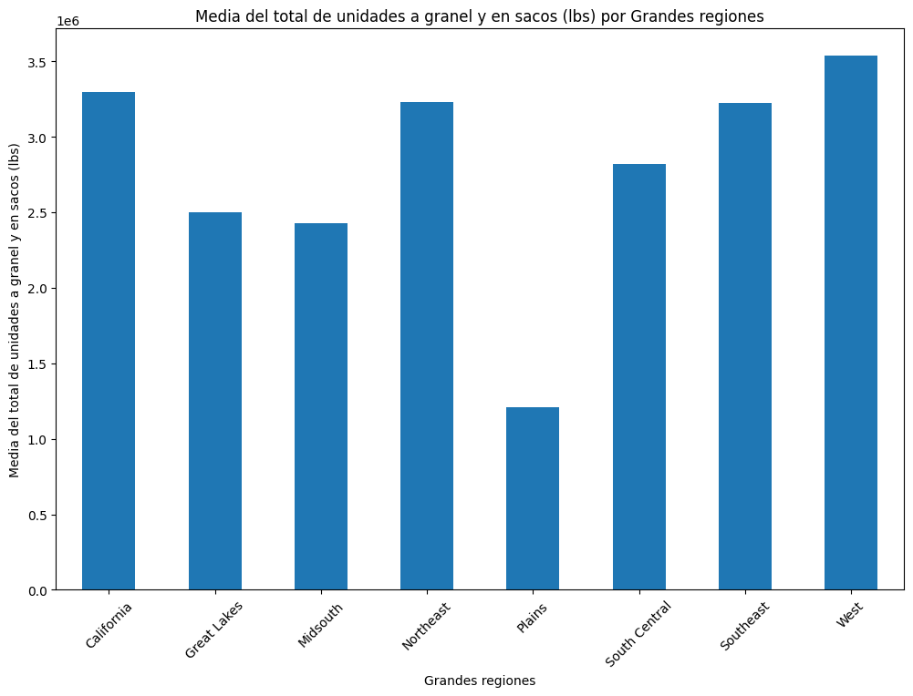
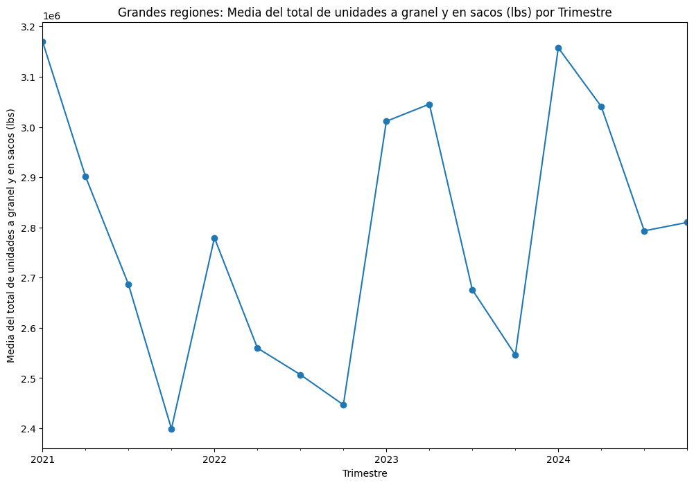
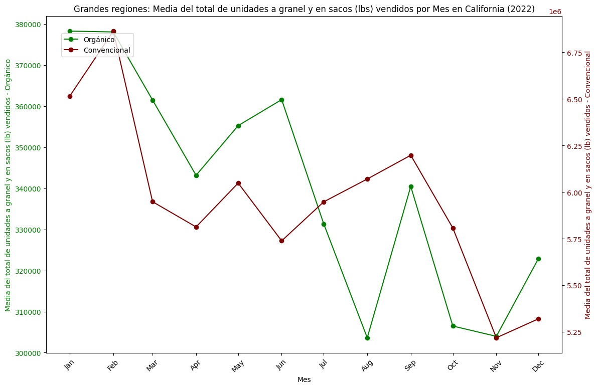
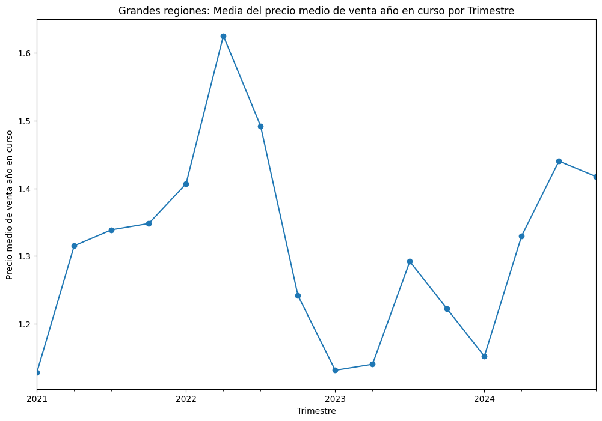
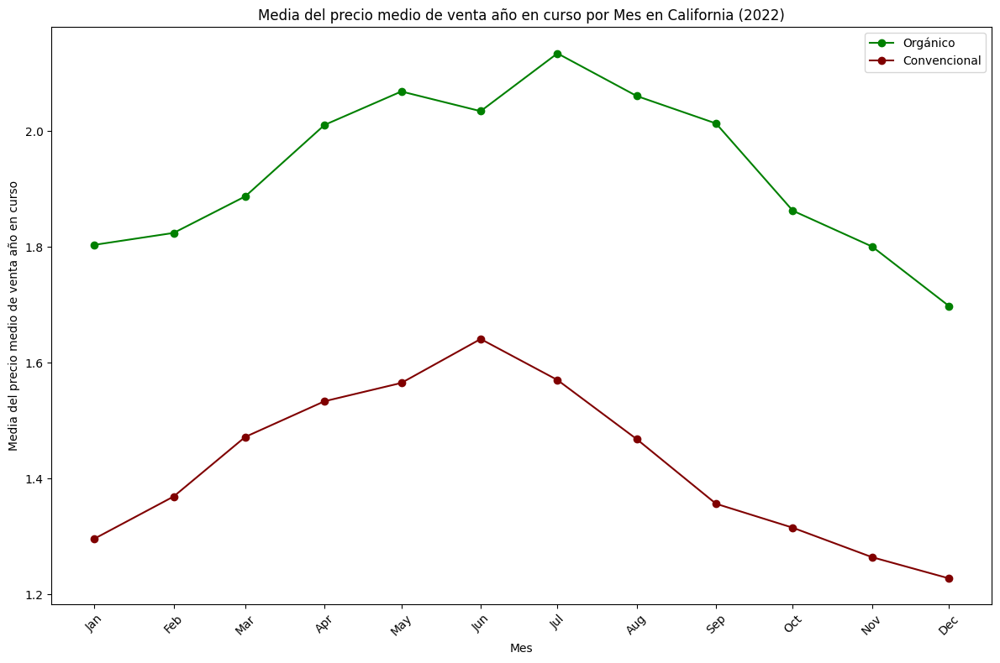
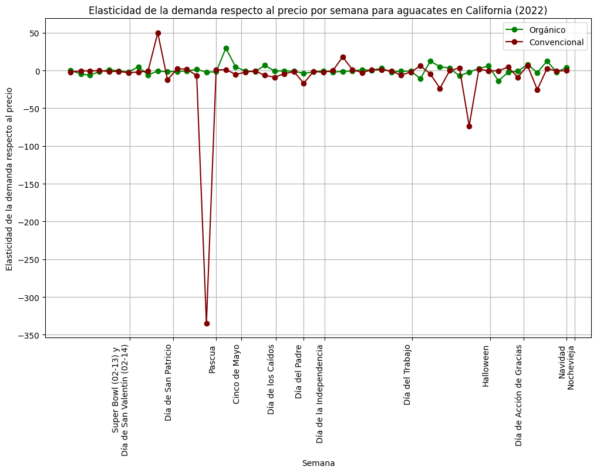

# **Informe del Análisis Exploratorio de Datos (EDA)**:
   - A continuación se presenta un informe en formato markdown que resuma los hallazgos clave del análisis exploratorio. Se incluyen visualizaciones de los patrones encontrados y explicaciones claras sobre las conclusiones obtenidas.

## **Base de datos de venta de aguacates (2021 - 2024) - Hass Avocado Board**

Resumen del Conjunto de Datos

**Base de datos**: Venta de aguacates (2021 - 2024) - Hass Avocado Board.  
**Número total de registros**: 24,536  
**Columnas**: 13 (4 categóricas y 9 numéricas).  

**Estructura del Conjunto de Datos**

**Tipo de objeto:** `pandas.core.frame.DataFrame`
**Rango de índices:** 24536 entradas, de 0 a 24535
**Columnas de datos (total 13 columnas):**

| #  | Columna                    | Conteo de No Nulos | Tipo de Dato |
|----|----------------------------|--------------------|--------------|
| 0  | Geography                  | 24536 no nulos     | object       |
| 1  | Timeframe                  | 24536 no nulos     | object       |
| 2  | Current Year Week Ending   | 24536 no nulos     | object       |
| 3  | Type                       | 24536 no nulos     | object       |
| 4  | ASP Current Year           | 24536 no nulos     | float64      |
| 5  | Total Bulk and Bags Units  | 24536 no nulos     | float64      |
| 6  | 4046 Units                 | 24536 no nulos     | float64      |
| 7  | 4225 Units                 | 24536 no nulos     | float64      |
| 8  | 4770 Units                 | 24536 no nulos     | float64      |
| 9  | TotalBagged Units          | 24536 no nulos     | float64      |
| 10 | SmlBagged Units            | 0 no nulos         | float64      |
| 11 | LrgBagged Units            | 0 no nulos         | float64      |
| 12 | X-LrgBagged Units          | 0 no nulos         | float64      |

**Tipos de datos:** float64(9), object(4)
**Uso de memoria:** 2.4+ MB

**Estadísticas Descriptivas**

Nota: Las columnas SmlBagged Units, LrgBagged Units y X-LrgBagged Units están completamente vacías.
| **Columna**                | **Promedio**   | **Desviación Estándar** | **Mínimo**   | **Máximo**        |
|----------------------------|----------------|--------------------------|--------------|-------------------|
| ASP Current Year           | 1.34           | 0.33                     | 0.61         | 3.18              |
| Total Bulk and Bags Units  | 1,018,375.21   | 4,063,736.12             | 2,676.10     | 60,346,460.00     |
| 4046 Units                 | 466,680.60     | 1,968,989.41             | 0.00         | 31,135,970.00     |
| 4225 Units                 | 211,843.90     | 902,626.28               | 0.00         | 18,105,900.00     |
| 4770 Units                 | 28,201.30      | 142,191.40               | 0.00         | 2,801,180.00      |
| TotalBagged Units          | 311,649.20     | 1,149,713.12             | 1,251.59     | 15,446,250.00     |

**Valores Únicos**

| **Columna**                | **Valores Únicos** |
|----------------------------|---------------------|
| Geography                  | 59                 |
| Timeframe                  | 1                  |
| Current Year Week Ending   | 208                |
| Type                       | 2                  |
| ASP Current Year           | 23,586             |
| Total Bulk and Bags Units  | 23,579             |
| 4046 Units                 | 23,348             |
| 4225 Units                 | 23,160             |
| 4770 Units                 | 13,313             |
| TotalBagged Units          | 23,571             |

Hallazgos Clave
1. Columna ASP Current Year (Precio promedio de aguacates por libra):
	- Promedio: $1.34 por libra.
	- Rango: desde $0.61 hasta $3.18.
	- La variación sugiere fluctuaciones significativas en los precios según la geografía o temporada.
2.	Volumen de ventas (Total Bulk and Bags Units):
	- Promedio de 1,018,375 unidades vendidas semanalmente.
	- Máximo alcanzado: 60,346,460 unidades en una sola semana.
3.	Patrones en los tipos de aguacates:
	- Las ventas están distribuidas entre tres tipos principales (4046, 4225, 4770).
	- El tipo más vendido es 4046 con un promedio de 466,681 unidades por semana.
4.	Datos faltantes:
	- Tres columnas (SmlBagged Units, LrgBagged Units, X-LrgBagged Units) están completamente vacías y pueden eliminarse del análisis.
5.	Geografía:
	- Las ventas se registran en 59 regiones diferentes, lo que permite un análisis regional detallado.

## **Análisis bivariado**

**Media del total de unidades a granel y en sacos (lbs) por Grandes regiones**

La gráfica de barras muestra la media del total de unidades a granel y en sacos (en libras) en diferentes grandes regiones. Las principales observaciones son:
1. La región Oeste tiene la media más alta, superando los 3.5 millones de libras, seguida de cerca por California y Sureste.
2.	La región de Plains presenta la media más baja, con poco más de 1 millón de libras, muy por debajo del resto de las regiones.
3.	Regiones como Noreste, Grandes Lagos y Midsouth muestran medias moderadas, cercanas a los 2.5 millones de libras.
4.	La región Centro Sur también destaca con un total relativamente alto, cercano a los 3 millones de libras.

Esto sugiere que las ventas de aguacates (medidas en unidades a granel y en sacos) son particularmente fuertes en las regiones Oeste, Sureste y California, mientras que la región de Plains muestra un rezago significativo.

**Grandes regiones: Media del total de unidades a granel y en sacos (lbs) por Trimestre**

La gráfica muestra la evolución trimestral de la media del total de unidades a granel y en sacos (en libras). Las principales observaciones son:
1.	2021 inicia con valores altos cercanos a los 3.2 millones de libras, pero presenta una caída constante a lo largo del año.
2.	A principios de 2022, se observa un mínimo alrededor de 2.4 millones de libras, seguido de un repunte temporal, aunque termina nuevamente en valores bajos.
3.	En 2023, hay un notable aumento significativo, alcanzando niveles por encima de los 3 millones de libras, seguido de una caída en los trimestres posteriores.
4.	El 2024 muestra un comportamiento volátil, con un máximo superior a los 3.2 millones de libras, seguido de una caída y un ligero repunte al final.

En general, la evolución por trimestre revela una tendencia cíclica con fuertes fluctuaciones, donde se alternan períodos de altas y bajas que sugieren estacionalidad o factores externos que afectan las ventas de unidades a granel y en sacos.

## **Base de datos de ventas de aguacates y proveedor en California (2022-2024)**

**Grandes regiones: Media del total de unidades a granel y en sacos (lbs) vendidos por Mes en California (2022)**

La gráfica muestra la media del total de unidades a granel y en sacos (en libras) vendidas por mes en California durante el 2022, diferenciando entre aguacates orgánicos y convencionales. Las observaciones clave son las siguientes:
1. Tendencia de Orgánico (línea verde):
    - Al inicio del año (enero y febrero), las ventas de aguacates orgánicos se mantienen altas, cerca de las 380,000 libras.
	- A partir de marzo, las ventas presentan una tendencia a la baja con fluctuaciones, alcanzando su mínimo en agosto con aproximadamente 300,000 libras.
	- En septiembre, hay un repunte significativo, pero cae nuevamente en octubre y noviembre, con una ligera recuperación en diciembre.
2.	Tendencia de Convencional (línea marrón):
	- Las ventas de aguacates convencionales comienzan en niveles altos en enero y febrero (alrededor de 6.6 millones de libras).
	- En marzo, se observa una fuerte caída, manteniéndose relativamente estables con pequeñas variaciones durante el resto del año.
	- El mes con mayor recuperación es septiembre, pero la tendencia general es descendente hacia finales del año.
3.	Comparación entre Orgánico y Convencional:
	- Los aguacates convencionales mantienen volúmenes de ventas significativamente superiores a los orgánicos a lo largo del año.
	- Sin embargo, las ventas de orgánicos muestran mayor volatilidad, con picos y caídas más marcados.

En resumen, las ventas de aguacates convencionales son más constantes y dominan en volumen total, mientras que las ventas de aguacates orgánicos son más fluctuantes y presentan periodos de recuperación y caídas abruptas.

**Grandes regiones: Media del precio medio de venta año en curso por Trimestre**

La gráfica muestra la media del precio medio de venta por trimestre a lo largo de los años 2021 a 2024 en grandes regiones. Las principales observaciones son las siguientes:
1. Tendencia ascendente en 2021 y 2022:
	- El precio medio de venta comienza en niveles bajos en 2021 (alrededor de 1.1) y experimenta un incremento constante hasta alcanzar su pico máximo en el primer trimestre de 2022, con un valor superior a 1.6.
	- Este periodo representa el máximo precio medio en toda la serie temporal.
2. Caída pronunciada en 2022 y 2023:
	- Después del pico en el primer trimestre de 2022, se observa una caída drástica a lo largo del resto del año, continuando en 2023, donde los precios alcanzan su punto más bajo en el primer trimestre, cercano a 1.1.
	- Este periodo muestra la mayor disminución en el precio medio de venta.
3. Recuperación parcial en 2023 y 2024:
	- A partir del segundo trimestre de 2023, se observa una ligera recuperación en los precios, con fluctuaciones a lo largo del año.
	- Para el 2024, los precios muestran un crecimiento significativo hasta el tercer trimestre, alcanzando valores cercanos a 1.45, aunque con una leve caída al final del año.

Resumen:
- El precio medio de venta muestra un aumento considerable entre 2021 y 2022, seguido de una fuerte caída en 2023.
- En 2024, se presenta una recuperación gradual, pero sin alcanzar los niveles máximos observados en 2022.
- Esta evolución sugiere una volatilidad en los precios con períodos de crecimiento y contracción, posiblemente influenciados por factores económicos o de oferta y demanda.

**Media del precio medio de venta año en curso por Mes en California (2022)**

La gráfica muestra la media del precio medio de venta por mes en California durante el año 2022, diferenciando entre aguacates orgánicos (línea verde) y convencionales (línea marrón). Las principales observaciones son:

Aguacates orgánicos:
1. Los precios comienzan en enero con un valor cercano a 1.80 y muestran una tendencia al alza hasta alcanzar su pico máximo en julio, con un valor superior a 2.15.
2.	A partir de agosto, los precios comienzan a disminuir progresivamente, cerrando el año en diciembre con un valor aproximado de 1.70.
3.	Los precios orgánicos se mantienen significativamente más altos que los convencionales durante todo el año.

Aguacates convencionales:
1.	Los precios inician en enero en un nivel mucho más bajo, alrededor de 1.30, y muestran una tendencia ascendente hasta alcanzar un pico en junio con un valor de aproximadamente 1.65.
2.	A partir de julio, los precios comienzan a descender de forma constante, cerrando el año en diciembre con un valor cercano a 1.25.

Comparación:
- Los aguacates orgánicos tienen un precio medio superior en comparación con los aguacates convencionales durante todo el año.
- La diferencia entre ambos tipos se mantiene constante, aunque se amplía ligeramente hacia la segunda mitad del año, especialmente cuando los precios convencionales caen más bruscamente.
- El comportamiento de ambos tipos de aguacates es similar: un aumento en la primera mitad del año, seguido de una caída en la segunda mitad.

Resumen:

El mercado de aguacates en 2022 muestra que los aguacates orgánicos tienen un mayor precio medio y son más estables en comparación con los convencionales, los cuales tienen precios más bajos y muestran una mayor volatilidad hacia finales del año.

## **Análisis de elasticidad de la demanda considerando los días festivos del año**

El siguiente análisis toma en cuenta los principales **días festivos** que ocurren a lo largo del año en el período 2021-2024, con el fin de evaluar la elasticidad de la demanda en relación con estos eventos clave.

| **Festivo**              | **Fecha**                                     | **2021**       | **2022**       | **2023**       | **2024**       |
|--------------------------|----------------------------------------------|----------------|----------------|----------------|----------------|
| **Super Bowl**         | Varía (Generalmente el primer domingo de febrero) | 07/02/2021     | 13/02/2022     | 12/02/2023     | 11/02/2024     |
| **Día de San Valentín**  | 14 de febrero                                |                |                |                |                |
| **Día de San Patricio**  | 17 de marzo                                  |                |                |                |                |
| **Pascua**               | Varía (Entre el 22 de marzo y el 25 de abril - domingo) | 04/04/2021     | 17/04/2022     | 09/04/2023     | 31/03/2024     |
| **Cinco de Mayo**        | 5 de mayo                                    |                |                |                |                |
| **Día de los Caídos**    | Último lunes de mayo                         | 31/05/2021     | 30/05/2022     | 29/05/2023     | 27/05/2024     |
| **Día del Padre**        | Tercer domingo de junio                      | 20/06/2021     | 19/06/2022     | 18/06/2023     | 16/06/2024     |
| **Día de la Independencia** | 4 de julio                                 |                |                |                |                |
| **Día del Trabajo**      | Primer lunes de septiembre                   | 06/09/2021     | 05/09/2022     | 04/09/2023     | 02/09/2024     |
| **Halloween**            | 31 de octubre                                |                |                |                |                |
| **Día de Acción de Gracias** | Cuarto jueves de noviembre               | 25/11/2021     | 24/11/2022     | 23/11/2023     | 28/11/2024     |
| **Navidad**              | 25 de diciembre                              |                |                |                |                |
| **Nochevieja**           | 31 de diciembre                              |                |                |                |                |

---

Este análisis permite identificar los posibles efectos estacionales en la elasticidad de la demanda, correlacionando los días festivos con las variaciones en el comportamiento de los consumidores.

**Elasticidad de la demanda respecto al precio por semana para aguacates en California (2022)**

La gráfica muestra la elasticidad de la demanda respecto al precio de aguacates orgánicos (línea verde) y convencionales (línea marrón) por semana en California durante el 2022, considerando las fechas festivas.

Observaciones clave:
- Los aguacates convencionales presentan picos extremos negativos alrededor de Pascua y fluctuaciones menores en otras fechas, lo que sugiere una alta sensibilidad de la demanda en esa semana.
- Los aguacates orgánicos muestran un comportamiento más estable, con una ligera elasticidad positiva en ciertas semanas como Cinco de Mayo.
- Las variaciones son más pronunciadas para los aguacates convencionales, reflejando una demanda más volátil frente a cambios en el precio en comparación con los orgánicos.

En resumen, la elasticidad de los convencionales es más sensible y volátil en fechas clave como Pascua, mientras que los orgánicos mantienen una elasticidad más controlada.