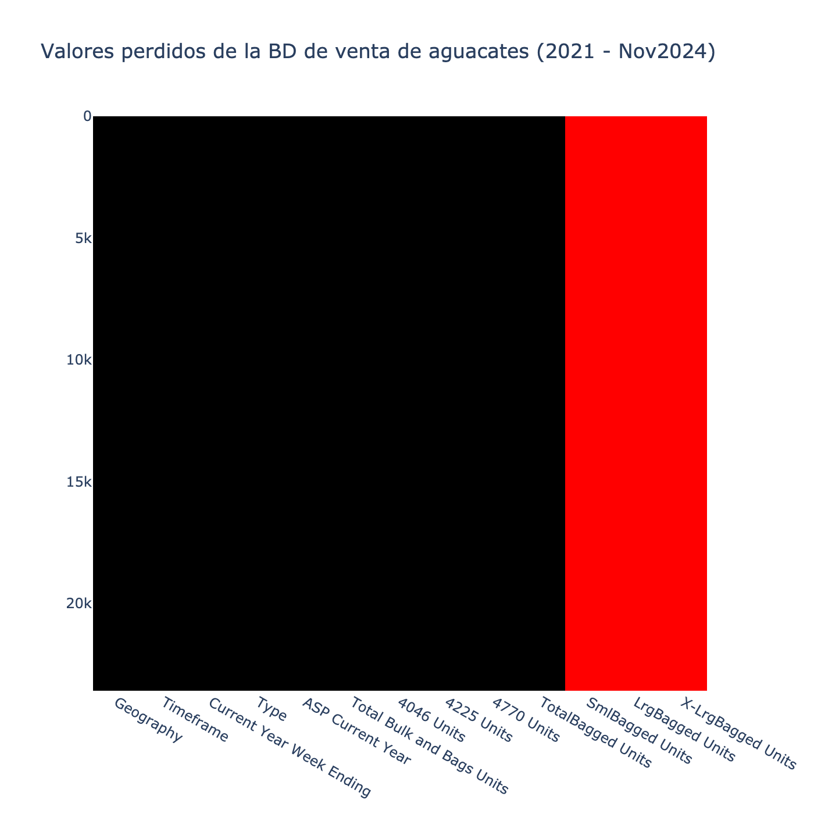
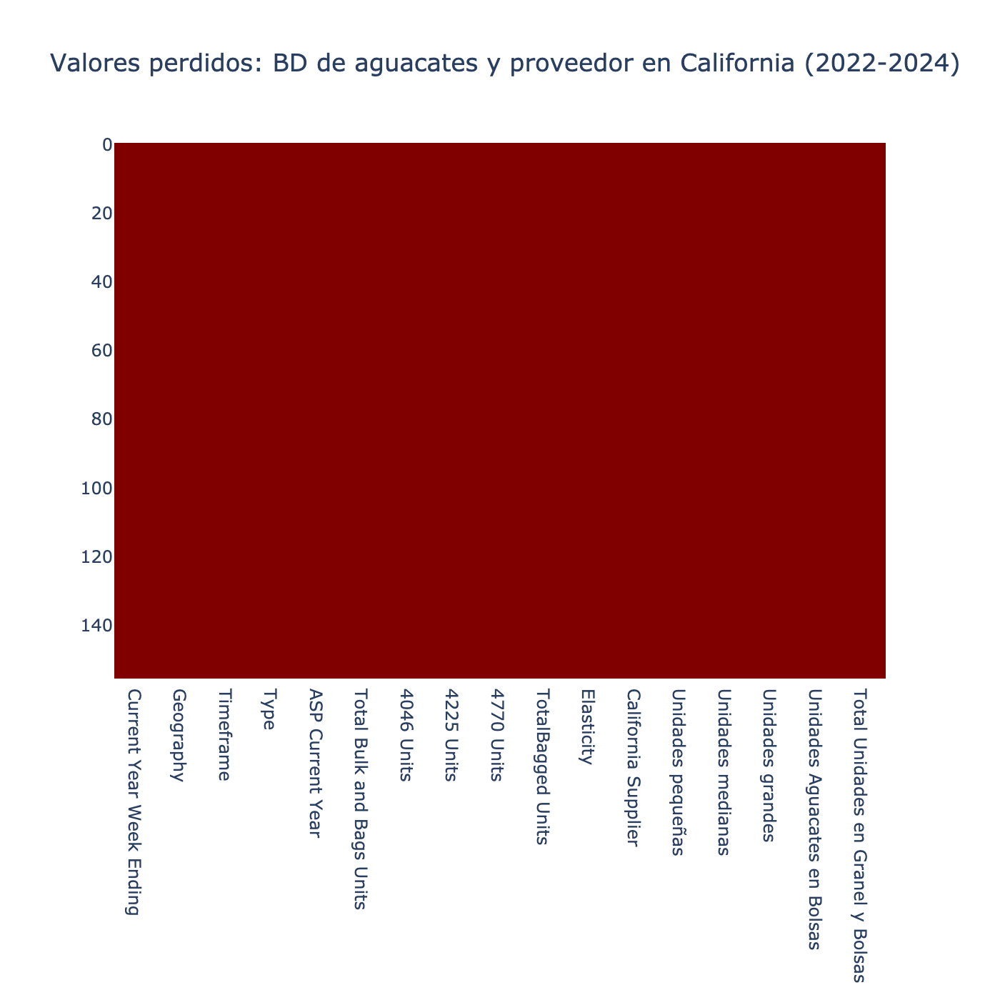

# **Informe de Calidad de los Datos**:
   - A continuación se presenta un informe detallado sobre la calidad de los datos, incluyendo los problemas identificados y las acciones tomadas para mejorarlos (tratamiento de valores faltantes, inconsistencias, etc.).

## **Base de datos de venta de aguacates (2021 - Noviembre de 2024) - Hass Avocado Board**

Se observa que la base de datos merged_df contiene registros hasta la semana 1 de noviembre de 2024. Para completar los datos faltantes del año, se llevaron a cabo los siguientes pasos:
1.	Se filtró el cuarto trimestre de los años 2021, 2022 y 2023 de la base de datos.
2.	Se calculó el promedio mensual de las columnas “ASP Current Year”, “Total Bulk and Bags Units”, “4046 Units”, “4225 Units”, “4770 Units” y “Total Bagged Units”, teniendo en cuenta la geografía y el tipo de aguacate.
3.	Se creó una nueva base de datos llamada proyeccion_df, que contiene la proyección de los datos correspondientes a las 3 semanas restantes de noviembre y las 5 semanas de diciembre de 2024, utilizando los resultados del cálculo anterior. El número de registros nuevos es 944, que corresponden a 8 semanas por cada tipo de aguacate, 16 por cada geografía (16*59 = 944)
4.	Finalmente, se combinó la base de datos merged_df con proyeccion_df.

**Tipo de objeto:** `pandas.core.frame.DataFrame`

**Rango de índices:** 24536 entradas, de 0 a 24535

**Columnas de datos (total 13 columnas):**

| #  | Columna                    | Conteo de No Nulos | Tipo de Dato    |
|----|----------------------------|--------------------|-----------------|
| 0  | Geography                  | 24536 no nulos     | object          |
| 1  | Timeframe                  | 24536 no nulos     | object          |
| 2  | Current Year Week Ending   | 24536 no nulos     | datetime64[ns]  |
| 3  | Type                       | 24536 no nulos     | object          |
| 4  | ASP Current Year           | 24536 no nulos     | float64         |
| 5  | Total Bulk and Bags Units  | 24536 no nulos     | float64         |
| 6  | 4046 Units                 | 24536 no nulos     | float64         |
| 7  | 4225 Units                 | 24536 no nulos     | float64         |
| 8  | 4770 Units                 | 24536 no nulos     | float64         |
| 9  | TotalBagged Units          | 24536 no nulos     | float64         |
| 10 | SmlBagged Units            | 0 no nulos         | float64         |
| 11 | LrgBagged Units            | 0 no nulos         | float64         |
| 12 | X-LrgBagged Units          | 0 no nulos         | float64         |

**Tipos de datos:** datetime64[ns](1), float64(9), object(3)

**Uso de memoria:** 2.4+ MB

## **Base de datos de proveedores de aguacates (2022-2024) - Hass Avocado Board**

**Tipo de objeto:** `pandas.core.frame.DataFrame`

**Rango de índices:** 208 entradas, de 0 a 207

**Columnas de datos (total 10 columnas):**

| #  | Columna              | Conteo de No Nulos | Tipo de Dato |
|----|----------------------|--------------------|--------------|
| 0  | Week Ending          | 208 no nulos       | object       |
| 1  | Year                 | 208 no nulos       | int64        |
| 2  | Status               | 208 no nulos       | object       |
| 3  | Total Volume         | 208 no nulos       | object       |
| 4  | California           | 208 no nulos       | object       |
| 5  | Chile                | 208 no nulos       | object       |
| 6  | Mexico               | 182 no nulos       | object       |
| 7  | Peru                 | 208 no nulos       | object       |
| 8  | Colombia             | 208 no nulos       | object       |
| 9  | Dominican Republic   | 156 no nulos       | object       |

**Tipos de datos:** int64(1), object(9)

**Uso de memoria:** 16.4+ KB

## **Base de datos de ventas de aguacates y proveedor en California (2022-2024)**

Reglas para mezclar la base de datos california_df y merged_suppliers:
Se agrupo por "Current Year Week Ending".
- "Geografía" y "Timeframe" tienen el mismo valor.
- "Tipo": Orgánico y Convencional
- "Precio medio de venta": media del precio del aguacate convencional y orgánico
- "Unidades totales a granel y sacos (lbs)": suma del volumen de aguacates convencional y orgánico
- "Unidades 4046 (pequeños)": suma del volumen de aguacates convencional y orgánico
- "Unidades 4225 (medianos)": suma del volumen de aguacates convencional y orgánico
- "Unidades 4770 (grandes)": suma del volumen de aguacates convencional y orgánico
- "Total de unidades embolsadas": suma del volumen de aguacates convencional y orgánico
- "Elasticidad": media de la elasticidad de la demanda de aguacates convencional y orgánico

Teniendo en cuenta que los datos en la base de datos de proveedores están expresados en unidades, mientras que la base de datos de ventas utiliza libras, se realizó la conversión de las columnas “4046 Units”, “4225 Units”, “4770 Units” y “TotalBagged Units” a unidades. Esta conversión se llevó a cabo utilizando el volumen promedio correspondiente a cada tipo de aguacate:
- 1 aguacate 4046 = 0.19 lbs
- 1 aguacate 4225 = 0.50 lbs
- 1 aguacate 4770 = 0.63 lbs
- Volumen promedio de un aguacate de “TotalBagged Units” = 0.5 lbs

Los resultados de esta transformación fueron almacenados en las columnas: “Unidades pequeñas”, “Unidades medianas”, “Unidades grandes” y “Unidades de aguacates en bolsas”. Posteriormente, la suma de estas columnas fue calculada y registrada en “Total Unidades en Granel y Bolsas”, que representa la métrica equivalente a “Total Bulk and Bags Units” en libras.

**Tipo de objeto:** `pandas.core.frame.DataFrame`

**Rango de índices:** 156 entradas, de 0 a 155

**Columnas de datos (total 17 columnas):**

| #  | Columna                           | Conteo de No Nulos | Tipo de Dato |
|----|-----------------------------------|--------------------|--------------|
| 0  | Current Year Week Ending          | 156 no nulos       | object       |
| 1  | Geography                         | 156 no nulos       | object       |
| 2  | Timeframe                         | 156 no nulos       | object       |
| 3  | Type                              | 156 no nulos       | object       |
| 4  | ASP Current Year                  | 156 no nulos       | float64      |
| 5  | Total Bulk and Bags Units         | 156 no nulos       | float64      |
| 6  | 4046 Units                        | 156 no nulos       | float64      |
| 7  | 4225 Units                        | 156 no nulos       | float64      |
| 8  | 4770 Units                        | 156 no nulos       | float64      |
| 9  | TotalBagged Units                 | 156 no nulos       | float64      |
| 10 | Elasticity                        | 156 no nulos       | float64      |
| 11 | California Supplier               | 156 no nulos       | object       |
| 12 | Unidades pequeñas                 | 156 no nulos       | float64      |
| 13 | Unidades medianas                 | 156 no nulos       | float64      |
| 14 | Unidades grandes                  | 156 no nulos       | float64      |
| 15 | Unidades Aguacates en Bolsas      | 156 no nulos       | float64      |
| 16 | Total Unidades en Granel y Bolsas | 156 no nulos       | float64      |

**Tipos de datos:** float64(12), object(5)

**Uso de memoria:** 20.8+ KB