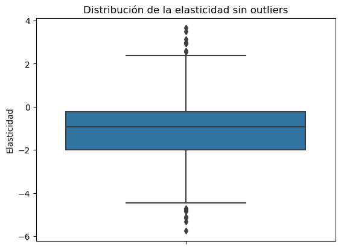
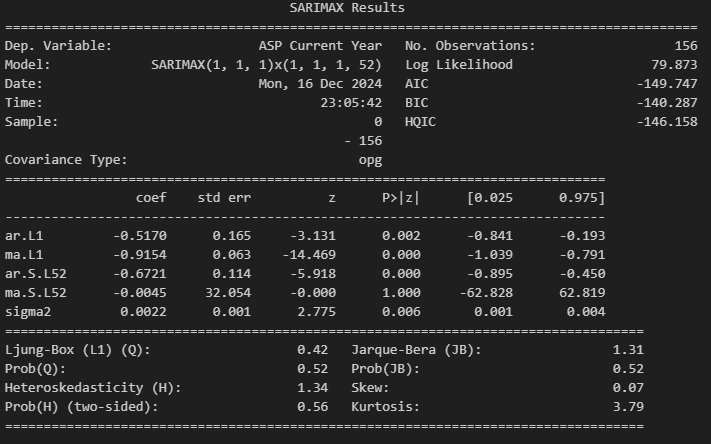
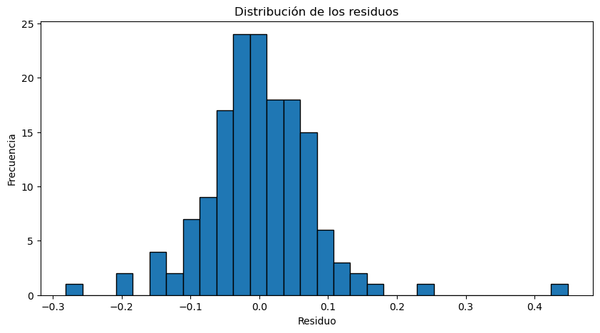

## Propósito de la regresión

Uno de los propósitos de hacer scrapping fue obtener los datos de exportaciones de California durante los periodos que hemos trabajado los datos, del 2021 al 2024. El obtener estos datos nos dio la motivación a intentar hallar una tasa de consumo interno de aguacates que se producían localmente en California y se exportaban directamente a las tiendas locales. Es por eso que quisimos calcular dicha tasa ya que durante el primer proyecto una de las regiones con comportamientos más peculiares era California y esto es debido a que no solamente es una de las regiones donde mayor cantidad de aguacates Hass se consume en todo EEUU, sino que también al ser exportadora queríamos ver cuánto de peso tenía sobre el precio final en esta región ya que los costes de producción podían ser más elevados, por lo tanto esperábamos que el precio fuera más alto en California también a modo de proteccionismo.

No solamente para estos análisis de regresión se incorporó la tasa de consumo interno, sino que también se añadieron parámetros como la elasticidad del precio sobre la demanda y también se quiso ajustar mejor las unidades vendidas, calculando el peso de cada tipo de aguacate, ya que en el dataset original, los datos de consumo nos venían dados en libras totales y no en valores unitarios.

### Cálculo de la tasa interna de consumo de aguacates

Tuvimos la problemática de que al querer mezclar la base de datos de Suppliers y la que contenía los datos de Consumo, no podíamos ignorar que la de Consumo tenía dos entradas (Una para orgánico y otra para convencional), mientras que la de Suppliers tenía solamente la entrada de los datos con las cifras de exportación total desde California.

Dada esta problemática nos decidimos por calcular una columna que recogiera el porcentaje de Exportaciones de California respecto al Consumo total en California. A pesar de ello esta medida es completamente inconsistente ya que el consumo de California puede venir de cualquier otro de los proveedores. Es por eso que decidimos calcular un Coeficiente del peso del consumo de aguacates en California respecto al resto de regiones. Una vez encontrado este peso, si fuera necesario podríamos implementar escala logarítmica para normalizar los datos.

La suma de los pesos es: 0.9999999999999999
Pesos regionales:
- California: 0.1577
- Great Lakes: 0.1087
- Midsouth: 0.1053
- Northeast: 0.1153
- Plains: 0.0564
- South Central: 0.1334
- Southeast: 0.1629
- West: 0.1603

Consumo ponderado de California: 5021151302.02 unidades

Para encontrar la tasa de consumo local aproximada de California, hemos calculado un coeficiente del peso de California respecto al consumo total en TotalUS. Esto nos garantiza que ahora los valores estén más ajustados a la realidad de que; Por los aguacates que son exportados de California, con un peso del 9% son consumidos en California, obteniendo así la tasa local de consumo de la siguiente manera. **Tasa de Consumo Local de California** = Exportaciones / (Consumo Total de California * Coeficiente peso relativo). Ahora ya le podemos dar sentido a los datos scrappeados y podemos proseguir con el modelo de regresión lineal.

Otra cosa importante a tener en cuenta era que al tener datos con frecuencias muy distintas (datos en millones y datos en valores más pequeños), nos disponemos a hacer un modelo LinLog, es decir, aplicar escala logarítmica a aquellos datos que tengan dimensiones en miles o millones. En este caso: "Unidades Pequeñas", "Unidades medianas", "Unidades grandes", "Total Unidades en Granel y Bolsas" y "California Supplier".

Se tuvo que arreglar antes de modelar los modelos de regresión los outliers en la Elasticidad. 

### Modelos de Regresión Lineal Múltiple:

Vemos que el ajuste del modelo és moderado ya que el Precio del Aguacate sólo viene explicado en un 47,3% por las variables exógenas. A nivel de coeficientes, la variable que más explican la variable del precio son la del tamaño del aguacate. Luego tan solo tenemos la variable de elasticidad que no és estadísticamente significativa ya que su P-Valor es mayor a 0.05. 

Razones  de este ajuste moderado:
1. Relaciones no lineales: Es posible que las variables independientes tengan una relación no lineal con el precio, lo que un modelo lineal simple no puede capturar.
2. Multicolinealidad: Las variables independientes podrían estar correlacionadas entre sí, lo que puede afectar la interpretación y efectividad del modelo.
3. Datos insuficientes o ruido: Los datos de consumo local y elasticidad, que son esenciales para modelar precios, no están incluidos o contienen ruido que dificulta obtener relaciones claras.
4. Distribución desigual de los datos: Si algunas variables tienen valores extremos o están sesgadas, esto puede afectar negativamente la performance del modelo.

### Modelos de Regularización y comparación con Regresión Lineal

Mejor alpha para Ridge: {'alpha': 0.868511373751352}
Intercepto del modelo: 1.5385934284339489

Error Cuadrático Medio (MSE) en entrenamiento: 0.011024201387216524
Error Cuadrático Medio (MSE) en prueba: 0.06255100596780575

Puntaje R^2 en entrenamiento: 0.48359414791063704
Puntaje R^2 en prueba: 0.4664921181319336

----------------------------------------------------------------------

Mejor alpha para Lasso: {'alpha': 0.001}
Intercepto del modelo: 1.5374798735016735

Error Cuadrático Medio (MSE) en entrenamiento: 0.011056578823687001
Error Cuadrático Medio (MSE) en prueba: 0.05086490060618046

Puntaje R^2 en entrenamiento: 0.4820774940432291
Puntaje R^2 en prueba: 0.4653571802023916

Podemos apreciar que según el modelo que escogamos, el peso será mayor o menor dependiendo de si hemos hecho técnicas de regularización o de regresión lineal. Cabe destacar que para la parametrización de los modelos de regularización se utilizaron los hiperparámetros más óptimos que garantizasen al modelo la mayor robustez posible. Al final se concluye que el ajuste es moderado, a pesar de que el componente estacional y el componente que se hayan mezclado ambos tipos de aguacate hace que el modelo tenga menos capacidad de ajuste.

Este gráfico pero nos puede estar indicando un overfitting ligero, ya que todos los valores de residuos están cerca de 0. 

### Regresión con Máquinas de Soporte Vectorial e Hiperplanos.

Cómo bien sabemos, estos datos tienen un componente de dispersión muy grande, cosa que el modelo de regresión lineal y el modelo de regularización solamente podian captar de manera moderada. Por ello se decidió utilizar hiperplanos para separar estos datos y hacer clusters e intentar tener algún modelo robusto que si entendiera el comportamiento del precio. 

Reporte de clasificación - Orgánicos:
              precision    recall  f1-score   support

        high       0.33      1.00      0.50        10
         low       0.73      0.53      0.62        15
      medium       0.67      0.11      0.18        19

    accuracy                           0.45        44
   macro avg       0.58      0.55      0.43        44
weighted avg       0.61      0.45      0.40        44

Matriz de Confusión - Orgánicos:
[[10  0  0]
 [ 6  8  1]
 [14  3  2]]
AUC para la clase high (Orgánicos): 0.7941176470588236
AUC para la clase low (Orgánicos): 0.8666666666666666
AUC para la clase medium (Orgánicos): 0.5768421052631578

---------------------------------------------------------------------------------

Reporte de clasificación - Convencionales:
              precision    recall  f1-score   support

        high       0.37      0.73      0.49        15
         low       0.41      0.90      0.56        10
      medium       0.00      0.00      0.00        27

    accuracy                           0.38        52
   macro avg       0.26      0.54      0.35        52
weighted avg       0.18      0.38      0.25        52

Matriz de Confusión - Convencionales:
[[11  4  0]
 [ 1  9  0]
 [18  9  0]]
AUC para la clase high (Convencionales): 0.7387387387387387
AUC para la clase low (Convencionales): 0.8904761904761904
AUC para la clase medium (Convencionales): 0.5333333333333333

---------------------------------------------------------------------------------

Precisión del modelo: 95.24%

Reporte de clasificación:

                precision    recall  f1-score   support

Conventional       0.95      0.95      0.95        42
     Organic       0.95      0.95      0.95        42

    accuracy                           0.95        84
   macro avg       0.95      0.95      0.95        84
weighted avg       0.95      0.95      0.95        84

La matriz de confusión nos da una precisión bastante elevada tanto de identificación de falsos positivos y falsos negativos, como de coeficiente de recall. 

Para ello se han utilizado los siguientes pasos: 
. Usar un set de prueba del 20% i uno de entrenamiento del 80%
. Creamos un modelo de soporte vectorial de dos dimensiones ya que estamos haciendo un análisis bidimensional. 

Precisión promedio del modelo con validación cruzada: 92.77%
Desviación estándar de la precisión: 9.37%

Apreciamos en este hiperplano como el modelo puede distinguir entre los aguacates de tipo orgánicos y de tipo convencional. Y cómo según el precio promedio que tenga, el modelo será capaz de distinguir que aguacates són convencionales y cuales són orgánicos. 

### Regresión mediante procesos estocásticos ARIMA

ARIMA es un modelo estadístico de series temporales, que tiene una estructura propia para tratar con datos dependientes del tiempo.

ARIMA está diseñado para trabajar con datos de series temporales, donde los valores observados en el tiempo presente dependen de los valores pasados (y en algunos casos, de la tendencia o estacionalidad).

Regresión lineal múltiple asume que las observaciones son independientes entre sí (no se toma en cuenta la dependencia temporal entre los datos).

Parámetros en ARIMA o SARIMA (Seasonal ARIMA) (p, d, q) + (P, D, Q)

Parámetro p: Captura la relación de un valor con sus propios valores pasados para ver la dependencia temporal. Este coeficiente mide el numero de rezagos (lags) que tiene el valor y que son explicados por observaciones anteriores. 

Parámetro d: Mide como de constantes són la varianza y la media dentro de una serie temporal. Muestra el número de diferenciaciones. 

Parámetro q: Muestra la Media móvil, que és la relación entre un valor y los errores del pasado, mostrando el número de errores pasados considerados.

IMPORTANTE: ARIMA no es un modelo de regresión lineal múltiple porque se basa en los valores pasados de la serie temporal y en los errores pasados, mientras que la regresión lineal múltiple usa variables independientes (predictoras) para estimar la variable dependiente.

Los coeficientes son estimados para representar las relaciones autoregresivas y de media móvil en el tiempo. És entonces, un modelo de dependencia temporal, que captura patrones en los datos a lo largo del tiempo (tendencias, ciclos, estacionalidad) y predice los valores futuros en función de estos patrones.

Estadístico ADF: -2.858183261545553
Valor p: 0.05043128970952864

Primeramente, podemos confirmar que el modelo es estacionario, es decir, que la media, la varianza y la autocorrelación se mantienen a lo largo de la serie temporal. Esto se confirma gracias a que el parámetro ADF (Dickey-Fuller) nos arroja un p-valor de 0,05 lo que nos hace  rechazar la hipótesis nula (por muy poco) y nos afirma que hay un componente de estacionariedad en este modelo. 

Hemos utilizado concretamente un modelo SARIMAX (1, 1, 1) x (1 , 1, 1, 52) quiere decir que los valores de p, q y d son 1, y como tenemos el componente estacional semanal de 52 semanas, el último coeficiente és 52. 
Por lo tanto:
p = 1, implica que se usa 1 rezago autoregresivo en el componente AR (esto es, el valor de la serie temporal pasada se utiliza para predecir el valor actual).

d = 1, implica que se realiza una diferenciación de primer orden para hacer que la serie sea estacionaria.

q = 1, implica que se usa 1 rezago de los residuos pasados en el componente de media móvil.

Este gráfico nos muestra que los residuos no se comportan de manera estandarizada, és decir que no siguen un ruido de camino blanco. Por lo tanto el modelo no padece de sobreajuste y puede ser útil para intentar predecir errores futuros también.

La FAS i la FAP, nos devuelven que claramente se evidencia una tendencia estacional, ya que los rezagos que hay con las temporalidades del periodo t, vienen correlacionadas desde varios periodos atrás.